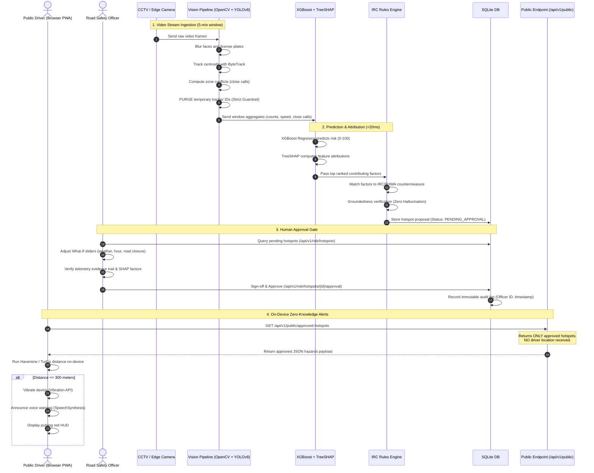

# RoadGuard AI - Data Flow & Sequence Architecture

```mermaid
sequenceDiagram
    autonumber
    actor Driver as Public Driver (Browser PWA)
    actor Officer as Road Safety Officer
    participant Cam as CCTV / Edge Camera
    participant Vision as Vision Pipeline (OpenCV + YOLOv8)
    participant ML as XGBoost + TreeSHAP
    participant Rules as IRC Rules Engine
    participant DB as SQLite DB
    participant PublicAPI as Public Endpoint (/api/v1/public)

    %% 1. Video Ingestion & Privacy Aggregation
    Note over Cam, Vision: 1. Video Stream Ingestion (5-min window)
    Cam->>Vision: Send raw video frames
    Vision->>Vision: Blur faces and license plates
    Vision->>Vision: Track centroids with ByteTrack
    Vision->>Vision: Compute zone conflicts (close calls)
    Vision->>Vision: PURGE temporary tracker IDs (Strict Guardrail)
    Vision->>ML: Send window aggregates (counts, speed, close calls)

    %% 2. Inference & SHAP Factor Attribution
    Note over ML, Rules: 2. Prediction & Attribution (<20ms)
    ML->>ML: XGBoost Regressor predicts risk (0-100)
    ML->>ML: TreeSHAP computes feature attributions
    ML->>Rules: Pass top ranked contributing factors
    Rules->>Rules: Match factors to IRC/FHWA countermeasure
    Rules->>Rules: Groundedness verification (Zero Hallucination)
    Rules->>DB: Store hotspot proposal (Status: PENDING_APPROVAL)

    %% 3. Human Approval Gate
    Note over Officer, DB: 3. Human Approval Gate
    Officer->>DB: Query pending hotspots (/api/v1/risk/hotspots)
    Officer->>Officer: Adjust What-If sliders (weather, hour, road closure)
    Officer->>Officer: Verify telemetry evidence trail & SHAP factors
    Officer->>DB: Sign-off & Approve (/api/v1/risk/hotspots/{id}/approval)
    DB->>DB: Record immutable audit log (Officer ID, timestamp)

    %% 4. Zero-Knowledge Public Alerts
    Note over Driver, PublicAPI: 4. On-Device Zero-Knowledge Alerts
    Driver->>PublicAPI: GET /api/v1/public/approved-hotspots
    Note over PublicAPI: Returns ONLY approved hotspots.<br/>NO driver location received.
    PublicAPI-->>Driver: Return approved JSON hazards payload
    Driver->>Driver: Run Haversine / Turf.js distance on-device
    alt Distance <= 300 meters
        Driver->>Driver: Vibrate device (Vibration API)
        Driver->>Driver: Announce voice warning (SpeechSynthesis)
        Driver->>Driver: Display pulsing red HUD
    end
```
